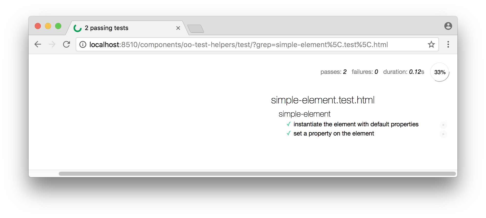

# oo-test-helpers

<!--  -->

> A set of utility classes and best practices for [Polymer 2.x](https://github.com/Polymer/polymer) to make testing easier with [web-component-tester](https://github.com/Polymer/web-component-tester).

**Table of Contents:**

<!-- TOC depthFrom:2 -->

- [Usage](#usage)
- [Reference](#reference)
- [Contributing](#contributing)
- [Questions and Answers](#questions-and-answers)

<!-- /TOC -->

## Usage

Add `oo-test-helpers` as dependency to your `bower.json`.

~~~json
{
  "dependencies": {
    "oo-test-helpers": "oolymer/oo-test-helpers#0.1.0"
  }
}
~~~

Add `browser.js`, `mocha-extensions.js`, `iron-test-helpers.html`, and `oo-test-helpers-html` to your `*.test.html`.

~~~html

<link rel="import" href="../../iron-test-helpers/iron-test-helpers.html">
<link rel="import" href="../../oo-test-helpers/oo-test-helpers.html">
~~~

## Reference

`setup.data(path, callbackWithData)`

*To be done.*

`setup.wait(callbackWithDone)`

*To be done.*

`test.wait(name, callbackWithDone)`

*To be done.*

`MockInteractions.click(node)`

*To be done.*

`MockInteractions.mouseenter(node)`

*To be done.*

`MockInteractions.mouseleave(node)`

*To be done.*

`MockInteractions.mouseover(node)`

*To be done.*

## Contributing

Install `npm` and `bower` dependencies.

~~~
$ npm install
$ npm run install:bower
~~~

Start the development server and open the default browser.

~~~
$ npm start
~~~

Run test suites in headless browsers.

~~~
$ npm test
~~~

## Questions and Answers

:question: How to write and run a basic test for a custom element?

Demo: :page_facing_up: [simple-element.test.html](test/simple-element.test.html).

It uses several libraries which are included in `web-component-tester`:

- Polymer's `<test-fixture>` (a custom element) to define test fixtures within a `<template>`: https://github.com/PolymerElements/test-fixture

- Mocha's (a test framework) TDD-style interface (`suite`, `test`, `setup`, `suiteSetup`, `teardown`, `suiteTeardown`): https://mochajs.org/#tdd

- Chai's (an assertion library) BDD-style `expect` interface (`expect(foo).to.equal("bar")`): http://www.chaijs.com/guide/styles/#expect

- Uses Sinon's (a mocking library) test spies, stubs and mocks (`sinon.spy()`, `sinon.stub()`, `sinon.mock()`): http://sinonjs.org/releases/v4.5.0/spy-call/

:question: How to test custom elements reasonably?

*To be done.*

:question: How run tests in a headless browser environment on a CI machine (continuous integration)?

Demo: :page_facing_up: [package.json](package.json), [wct-headless.conf.json](wct-headless.conf.json), [.travis.yml](.travis.yml).

*To be done.*

> File: `package.json` (excerpt)
~~~json
"test:headless": "./node_modules/.bin/wct --expanded --local chrome --local firefox --configFile 'wct-headless.conf.json'",
~~~

> File: `wct-headless.conf.json`
~~~json
{
  "suites": [
    "test/index.html"
  ],
  "environmentImports": [
    "test-fixture/test-fixture.html"
  ],
  "plugins": {
    "local": {
      "browserOptions": {
        "chrome": [
          "window-size=1920,1080",
          "headless",
          "disable-gpu",
          "no-sandbox"
        ],
        "firefox": [
          "-headless"
        ]
      }
    }
  }
}
~~~

WCT Runner Config:
- https://github.com/Polymer/web-component-tester/blob/master/runner/config.ts

WCT Plugin Options:
- https://github.com/Polymer/wct-local/blob/master/src/plugin.ts

References:
> Headless Chrome is shipping in Chrome 59 (June 5, 2017).
- https://developers.google.com/web/updates/2017/04/headless-chrome

> Headless Firefox works on Fx55+ (August 8, 2017) on Linux, and 56+ (September 28, 2017) on Windows/Mac.
- https://developer.mozilla.org/en-US/Firefox/Headless_mode

:question: How run tests in a development environment on a local machine?

Demo: :page_facing_up: [package.json](package.json).

*To be done.*

> File: `package.json` (excerpt)
~~~json
"serve": "./node_modules/.bin/polymer serve --port $npm_package_config_portServe",
"serve:watch": "./node_modules/.bin/browser-sync start --port $npm_package_config_portServeWatch --proxy \"localhost:$npm_package_config_portServe\" --no-ui --files '*.js, *.html, demo/**/*.html, src/**/*.html, test/**/*.html' --startPath \"/components/$npm_package_name/\"",
~~~

> File: `package.json` (excerpt)
~~~json
"test:chrome": "./node_modules/.bin/polymer test --local chrome --persistent --skip-selenium-install",
"test:firefox": "./node_modules/.bin/polymer test --local firefox --persistent --skip-selenium-install",
~~~

> Browsersync works by injecting an asynchronous script tag (``) right after the `<body>` tag during initial request. In order for this to work properly the `<body>` tag must be present.

- https://github.com/BrowserSync/browser-sync#requirements

:question: How to setup and cleanup test fixtures (custom components)?

Demo: :page_facing_up: [simple-element.test.html](test/simple-element.test.html).

You can define your test fixtures within a `<template>` using https://github.com/PolymerElements/test-fixture (which is included in `web-component-tester`).

`<test-fixture>` is used to prevent shared state, i.e. it will copy a clean, new instance of template content into each test suite (see: https://www.polymer-project.org/2.0/docs/tools/tests#test-fixtures).

:question: How to setup and cleanup test fixtures (serialized objects from json files)?

Demo: :page_facing_up: [fixture-data.test.html](test/fixture-data.test.html).

*To be done.*

~~~js
window.fetch("./fixtures/properties-for-custom-element.json")
  .then(response => response.json())
  .then(json => console.log(json))
~~~

References:
- https://github.com/github/fetch

:question: How to pause on setup or on cleanup to see and interact with test fixtures (custom components) manually?

Demo: :page_facing_up: [mocha-extensions.js](mocha-extensions.js).

*To be done.*

~~~js
function setupBlocked(block) {
  setup(function(done) {
    this.enableTimeouts(false)
    block(done)
  })
}

suite("button", () => {
  setupBlocked(() => {
    const button = fixture("button-fixture")
  })
})
~~~

~~~js
const tddMocha = Mocha.interfaces.tdd
Mocha.interfaces.tdd = function tdd(suite) {
  tddMocha(suite)
  suite.on("pre-require", (context, file, mocha) => {
    context.setup.blocked = function blocked(block) {
      context.setup(function(done) {
        this.enableTimeouts(false)
        block(done)
      })
    }
  })
}

suite("button", () => {
  setup.blocked(() => {
    const button = fixture("button-fixture")
  })
})
~~~

:question: How to simulate user interactions on test fixtures (custom components)?

Demo: :page_facing_up: [user-interaction.test.html](test/user-interaction.test.html).

You can import `iron-test-helpers.html` from https://github.com/PolymerElements/iron-test-helpers and use the methods provides in `global.MockInteractions` within your test suites.

:question: How to use stub elements (custom components)?

You can replace elements with stub elements to test them in isolation.

~~~js
setup(() => {
  replace("paper-button").with("fake-paper-button")
})
~~~

You can overwrite (replace) default implementions with custom methods.

~~~js
setup(() => {
  stub("paper-button", {
    click: () => {
      console.log("paper-button#click() called")
    }
  })
})
~~~

References:
- https://www.polymer-project.org/2.0/docs/tools/tests#create-stub-elements
- https://www.polymer-project.org/2.0/docs/tools/tests#create-stub-methods

